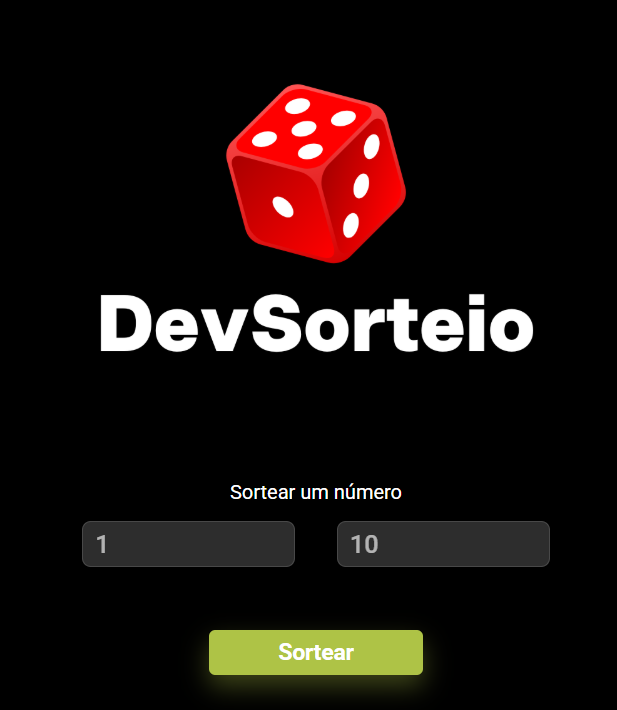

# 🎲 DevSorteio

Aplicação web simples para sorteio de números, desenvolvida como parte de um projeto de curso.

## 📌 Sobre o projeto

O DevSorteio permite gerar um número aleatório dentro de um intervalo definido pelo usuário.
Basta informar o número mínimo e máximo para realizar o sorteio.

## 🌐 Acesse o projeto

👉 [Clique aqui para acessar](https://feramos1987.github.io/Sorteador-de-numeros/)

## 🖼️ Preview

## 🚀 Funcionalidades

* Definir número mínimo
* Definir número máximo
* Sorteio de número aleatório
* Interface simples e intuitiva

## 🛠️ Tecnologias utilizadas

* HTML
* CSS
* JavaScript

## ▶️ Como usar

1. Digite o número mínimo
2. Digite o número máximo
3. Clique no botão **Sortear**
4. Veja o número gerado

## 🎯 Objetivo

Praticar conceitos fundamentais de JavaScript, como:

* Geração de números aleatórios
* Manipulação do DOM
* Eventos de clique
* Interação com o usuário

## 📚 Aprendizados

Durante o desenvolvimento deste projeto, foram reforçados conhecimentos em:

* Lógica de programação
* Validação de dados
* Criação de interfaces interativas

---

✨ Projeto desenvolvido para fins de aprendizado.
